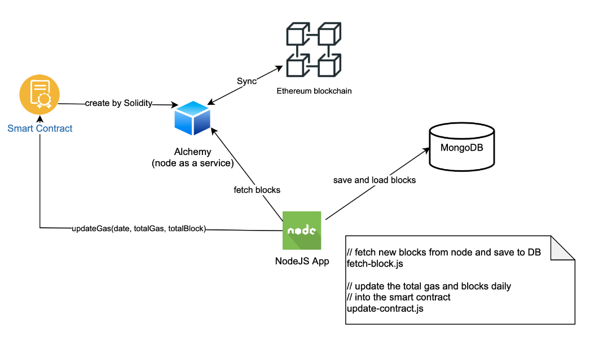

# Gas Fee Report Project

## Background
This project is to respond a code challenge to the problems below.

1. Develop a Node.js app to pull new blocks from the Ethereum blockchain and store them into a database including the transaction contained within those blocks.

2. After each day, a total number of blocks and total ETH spent on gas fees for that day is written in a simple smart contract.

3. Only this app can write to this smart contract.


## Setup

### Pre-requisite
You should have the following installed
* Node and npm
* MongoDB
* Developer account registered in Infura.io or Alchemy.com (free)

If you want to run your own Ethereum node, you may check out [GETH](https://geth.ethereum.org).

### Architecture



### Installation Procedure
1. Deploy the contract *gasReport.sol* using Solidity. I recommend Rinkeby test network.
2. Create an .env file under the project folder with parameters

- accountAddress: External Owned Account used to deploy the smart contract
- privateKey: Private key of the account above
- contractAddress: Address of deployed smart contract 
- web3Provider: Web3 provider to fetch Ethereum data
- AlchemyAPIKey: API key to use Alchemy service
   
Example:
```
accountAddress=0x2a87E5064aE8F6429A65ab3Cf883B380E11bd46C
privateKey=85882cf7e98c6e64b7f2f68eef363140a819e82e178da243f5fa615c6285915b
contractAddress=0xF1a210687CD51A3559D9cBf95D43F772F613085F
web3Provider=https://rinkeby.infura.io/v3/d5044c16ac6b4df59a5801631868822e
AlchemyAPIKey=B21Bb7zEchGknjjByOos-Ak5ilRE-do9
```

3. Update ./src/config/config.json

- batchSize: number of concurrent process to fetch blocks. My laptop CPU usage is at peak at 400. You may adjust to fit your hardware.
- initBlock: The initial block number to fetch since we do not want to fetch the whole blockchain.
- saveBlock: It stores the last successful block number stored in the DB. Make it same as initBlock value.
- latestBlock: It stores the latest block number by the time we run fetch-block.js.

Example:

```
{
  "batchSize": 400,
  "initBlock": 9990000,
  "savedBlock": 9990000,
  "latestBlock": 10074668
}
```

4. Update the connection string of MongoDB *./src/db/mongoose.js*

### Usage 
Go to the project folder *gasFeeProject*

#### To fetch the blocks from Etherem blockchain, run
> node src/fetch-block.js

We can abort anytime during fetching. The app can continue from where we stopped last time.


#### To update the gas fee with the DB data, run
> node src/update-contract YYYY-MM-DD

Example:
> node src/update-contract 2022-01-21

The app will continue to hold as it is connecting to the DB. Press "Ctrl-C" to terminate the program when you finish.
